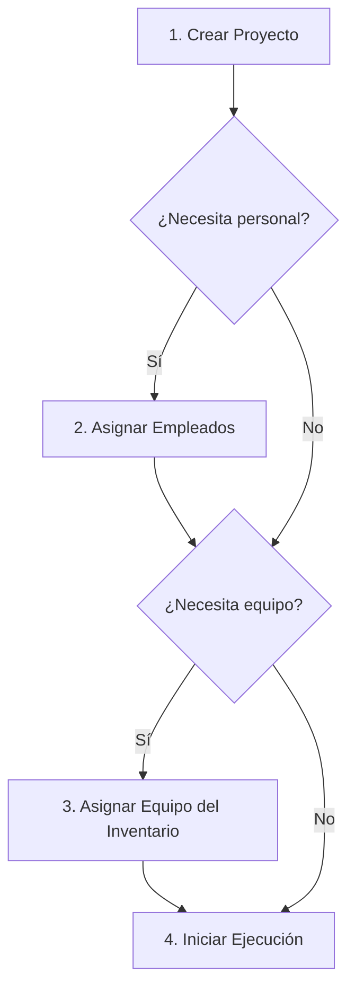
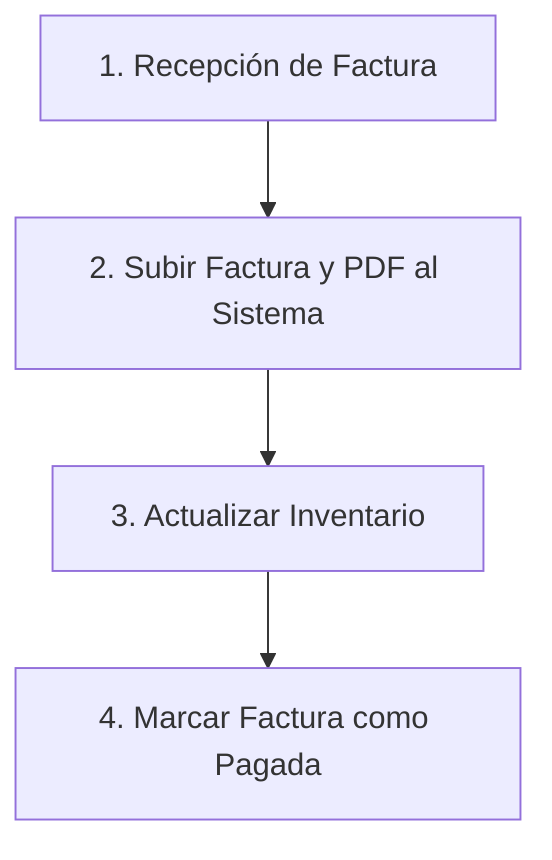
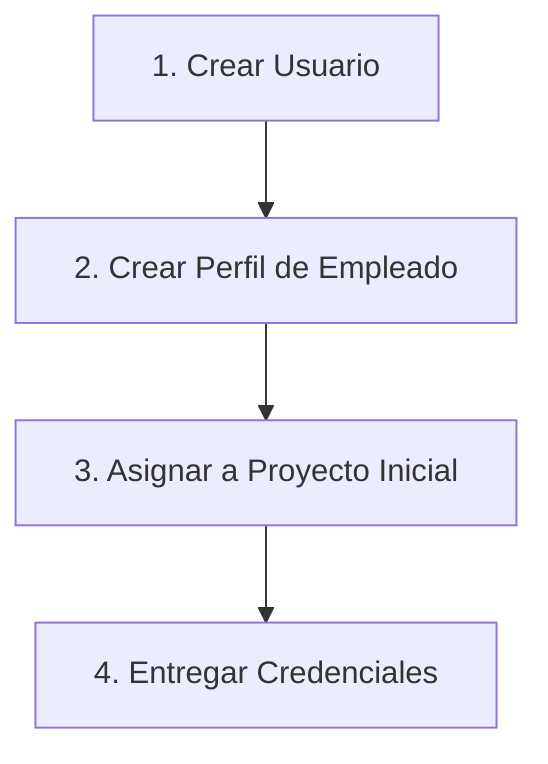

# 🎯 MANUAL 7: CASOS DE USO Y WORKFLOWS - SISTEMA CONA

## 📋 **INFORMACIÓN DEL DOCUMENTO**

**Fecha de Creación**: 21 de Julio de 2025  
**Proyecto**: Sistema CONA (Gestión CONAVEG)  
**Audiencia**: Usuarios, Gerentes, Analistas de Negocio  
**Nivel**: Intermedio  
**Tiempo Estimado**: 1.5 - 2.5 horas  
**Última Actualización**: 21 de Julio de 2025  

---

## 🎯 **OBJETIVOS DE APRENDIZAJE**

Al finalizar este manual, serás capaz de:
- ✅ Entender los flujos de trabajo completos del negocio implementados en el Sistema CONA.
- ✅ Ejecutar casos de uso típicos del día a día, integrando diferentes módulos.
- ✅ Aplicar las mejores prácticas para maximizar la eficiencia operativa.
- ✅ Resolver problemas comunes que surgen durante los flujos de trabajo.
- ✅ Comprender cómo las acciones en un módulo afectan a otros.

---

## 🚀 **INTRODUCCIÓN A LOS WORKFLOWS**

Mientras que el "Manual de Usuario Final" se enfoca en las funcionalidades de cada módulo de forma aislada, este manual se centra en cómo **conectar esas funcionalidades** para realizar tareas complejas del negocio. Un workflow es una secuencia de pasos que involucra a múltiples módulos y, a menudo, a diferentes roles de usuario.

Comprender estos flujos de trabajo te ayudará a ver el sistema como un todo integrado y a utilizarlo de la manera más efectiva posible.

---

## 🔄 **WORKFLOW 1: GESTIÓN COMPLETA DE UN NUEVO PROYECTO**

Este workflow describe el proceso desde la creación de un proyecto hasta la asignación de personal y recursos del inventario.

**Roles Involucrados**: Gerente, Empleado.

### **Diagrama del Flujo de Trabajo**:

### **Paso 1: Crear un Nuevo Proyecto (Rol: Gerente)**
- **Contexto**: Se ha aprobado un nuevo contrato y es necesario crear el proyecto en el sistema.
- **Acción**:
    1.  Navega al módulo de **Proyectos**.
    2.  Haz clic en "Nuevo Proyecto".
    3.  Rellena todos los detalles: nombre, cliente, presupuesto, fechas estimadas.
    4.  Guarda el proyecto. El estado inicial será "Pendiente" o "Planificado".
- **Resultado**: El proyecto existe en el sistema y es visible para todos los usuarios con permisos.

### **Paso 2: Asignar Empleados al Proyecto (Rol: Gerente)**
- **Contexto**: El proyecto necesita un equipo para su ejecución.
- **Acción**:
    1.  Abre el proyecto recién creado.
    2.  Ve a la pestaña o sección de "Equipo del Proyecto".
    3.  Haz clic en "Asignar Empleado".
    4.  Selecciona los empleados necesarios de la lista y define su rol en el proyecto.
- **Resultado**: Los empleados seleccionados ahora están vinculados al proyecto. Ellos podrán ver este proyecto en su lista de "Mis Proyectos".

### **Paso 3: Asignar Equipo del Inventario (Rol: Gerente)**
- **Contexto**: El equipo asignado necesita herramientas y equipos específicos del inventario.
- **Acción**:
    1.  Navega al módulo de **Inventario**.
    2.  Busca los ítems necesarios (ej. "Laptop Dell", "Taladro Inalámbrico").
    3.  Selecciona los ítems y utiliza la acción "Registrar Movimiento de Salida".
    4.  En la descripción del movimiento, especifica que la salida es para el "Proyecto X".
- **Resultado**: El stock de los ítems en el inventario se reduce. Queda un registro en los **Movimientos de Inventario** que asocia la salida del equipo con el proyecto, asegurando la trazabilidad.

### **Paso 4: Iniciar Ejecución del Proyecto (Rol: Gerente)**
- **Contexto**: Con el personal y los recursos asignados, el proyecto puede comenzar.
- **Acción**:
    1.  Vuelve al módulo de **Proyectos**.
    2.  Edita el proyecto y cambia su estado a "En Progreso".
- **Resultado**: El proyecto está oficialmente activo. El personal asignado puede comenzar a registrar sus horas y avances.

---

## 🔄 **WORKFLOW 2: PROCESO DE COMPRA Y REGISTRO DE FACTURA**

Este workflow cubre el ciclo de vida de una compra a un proveedor, desde la recepción de la factura hasta su registro en el sistema.

**Roles Involucrados**: Personal Administrativo (con rol de Gerente o similar), Gerente.

### **Diagrama del Flujo de Trabajo**:

### **Paso 1: Recepción de la Factura del Proveedor**
- **Contexto**: Se ha realizado una compra de nuevos equipos y el proveedor ha enviado la factura en formato PDF.
- **Acción**: El personal administrativo recibe el email con la factura y guarda el archivo PDF.

### **Paso 2: Subir la Factura y el PDF al Sistema (Rol: Gerente/Admin)**
- **Contexto**: La factura debe ser registrada en el sistema para control y contabilidad.
- **Acción**:
    1.  Navega al módulo de **Facturas**.
    2.  Haz clic en "Subir Factura".
    3.  Adjunta el archivo PDF de la factura.
    4.  Completa todos los datos del formulario: proveedor, número de factura, fechas, monto total.
    5.  Guarda la factura. El estado inicial será "Pendiente".
- **Resultado**: La factura está registrada en el sistema con su documento digital adjunto, accesible para consulta y descarga.

### **Paso 3: Actualizar el Inventario (Rol: Gerente/Admin)**
- **Contexto**: Los productos comprados deben ser añadidos al stock del inventario.
- **Acción**:
    1.  Ve al módulo de **Inventario**.
    2.  Busca los productos que se compraron. Si son nuevos, créalos primero.
    3.  Para cada producto, selecciona "Registrar Movimiento de Entrada".
    4.  En la cantidad, introduce el número de unidades recibidas. En la descripción, puedes hacer referencia al número de factura (ej. "Entrada según Factura F-2024-001").
- **Resultado**: El stock de los productos se incrementa, reflejando la nueva compra.

### **Paso 4: Marcar la Factura como Pagada (Rol: Gerente/Admin)**
- **Contexto**: Una vez que el departamento de finanzas ha realizado el pago al proveedor.
- **Acción**:
    1.  Vuelve al módulo de **Facturas**.
    2.  Busca la factura correspondiente.
    3.  Edítala y cambia su estado a "Pagada".
- **Resultado**: El ciclo de la factura se completa. El sistema refleja que la deuda con el proveedor ha sido saldada.

---

## 🔄 **WORKFLOW 3: ONBOARDING DE UN NUEVO EMPLEADO**

Este workflow detalla los pasos para registrar a un nuevo empleado en el sistema y prepararlo para trabajar.

**Roles Involucrados**: Administrador (o RRHH con rol Admin).

### **Diagrama del Flujo de Trabajo**:

### **Paso 1: Crear la Cuenta de Usuario (Rol: Admin)**
- **Contexto**: Un nuevo empleado se une a la empresa y necesita acceso al sistema.
- **Acción**:
    1.  Navega a la sección de **Usuarios**.
    2.  Haz clic en "Crear Usuario".
    3.  Introduce el `userName`, `email` y una contraseña temporal segura.
    4.  Asigna el rol correspondiente (normalmente **Empleado** o **User**).
- **Resultado**: Se crea la cuenta de acceso al sistema.

### **Paso 2: Crear el Perfil de Empleado (Rol: Admin)**
- **Contexto**: La cuenta de usuario necesita estar vinculada a un perfil de empleado con datos laborales.
- **Acción**:
    1.  Navega al módulo de **Empleados**.
    2.  Haz clic en "Nuevo Empleado".
    3.  Completa la información del empleado: nombre completo, DNI, cargo, fecha de contratación, etc.
    4.  Asegúrate de vincular este perfil con la cuenta de usuario creada en el paso anterior.
- **Resultado**: El empleado ahora tiene un perfil completo en el sistema.

### **Paso 3: Asignar a un Proyecto Inicial (Opcional, Rol: Gerente/Admin)**
- **Contexto**: El nuevo empleado ya tiene un proyecto asignado desde su primer día.
- **Acción**: Sigue los pasos del **Workflow 1, Paso 2** para asignar al nuevo empleado a su primer proyecto.
- **Resultado**: El empleado podrá ver sus responsabilidades desde el primer inicio de sesión.

### **Paso 4: Entregar Credenciales y Primeros Pasos**
- **Contexto**: El empleado necesita saber cómo acceder y qué hacer.
- **Acción**:
    1.  Comunica de forma segura al nuevo empleado su email y contraseña temporal.
    2.  Indícale que, en su primer login, debe cambiar la contraseña.
    3.  Proporciónale una copia o enlace al **Manual de Usuario Final**.
- **Resultado**: El empleado puede acceder al sistema de forma autónoma y comenzar a ser productivo.

---

## 🤔 **FAQ Y SOLUCIÓN DE PROBLEMAS COMUNES**

**P: He asignado un empleado a un proyecto, pero no puede ver los detalles. ¿Por qué?**
**R:** Verifica los permisos del rol del empleado. Si tiene el rol **USER**, solo podrá ver la lista de proyectos pero quizás no todos los detalles. Si tiene el rol **EMPLEADO**, debería poder ver más información. Asegúrate de que la asignación se guardó correctamente.

**P: Registré una entrada de inventario, pero el stock no se actualizó.**
**R:** Revisa los **Movimientos de Inventario** para el producto en cuestión. Es posible que el movimiento se haya registrado como una "salida" en lugar de una "entrada". Si es así, un Gerente o Admin deberá corregir el movimiento.

**P: ¿Puedo eliminar una factura si me equivoqué al subirla?**
**R:** La eliminación de registros críticos como las facturas suele estar restringida al rol de **Admin** para evitar la pérdida accidental de datos. Lo más probable es que necesites contactar a un administrador. Una alternativa es editar la factura y cambiar su estado a "Anulada".

**P: Cree un usuario pero olvidé crear su perfil de empleado. ¿Qué pasa?**
**R:** El usuario podrá iniciar sesión, pero es posible que no pueda acceder a funcionalidades que dependen de su perfil de empleado (como el registro de asistencia o la asignación a proyectos). Debes ir al módulo de **Empleados** y crear el perfil faltante, asegurándote de vincularlo a la cuenta de usuario existente.

---

## 📞 **SOPORTE Y CONTACTO**

Para dudas sobre los flujos de trabajo que no estén resueltas en este manual, contacta a:
- 📧 **Email**: business-process@conaveg.com
- 💬 **Canal de Slack**: #cona-workflows

---

**📅 Fecha de Creación**: 21 de Julio de 2025  
**👨‍💻 Responsable**: Equipo de Análisis de Negocio CONA  
**📋 Estado**: Manual Completo y Validado  
**🔄 Próxima Revisión**: 21 de Agosto de 2025
